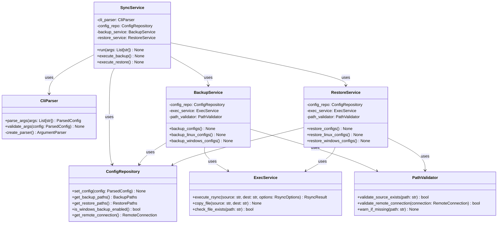

# AI Agent Config Sync Tool - Design Document

## Overview

The AI Agent Config Sync Tool is a CLI application designed to synchronize Claude Code and Gemini CLI configurations between local environments (Linux and Windows via WSL) and a remote server. The tool provides backup and restore functionality with intelligent file protection and cross-environment support.

## Requirements

### Core Features
- **CLI-only configuration**: All parameters via command-line arguments, no config files
- **Dual subcommands**: `backup` (upload to remote) and `restore` (download from remote)
- **Cross-platform support**: Linux native and Windows via `/mnt/c/` WSL mounting
- **File protection**: Uses rsync's `--update` flag by default, `--force` to override
- **Source validation**: Checks file existence, warns and skips missing files
- **Environment selection**: Choose between Linux/Windows versions of CLAUDE.md and GEMINI.md

### Supported Files
- **Claude Code**: 
  - `~/.claude.json` (Linux), `/mnt/c/Users/{user}/.claude.json` (Windows)
  - `~/.claude/CLAUDE.md` (Linux), `/mnt/c/Users/{user}/.claude/CLAUDE.md` (Windows)
- **Gemini CLI**: 
  - `~/.gemini/settings.json` (Linux), `/mnt/c/Users/{user}/.gemini/settings.json` (Windows)
  - `~/.gemini/GEMINI.md` (Linux), `/mnt/c/Users/{user}/.gemini/GEMINI.md` (Windows)

## CLI Interface

### Main Command
```bash
sync-ai-config <subcommand> [options]
```

### Backup Subcommand
```bash
sync-ai-config backup [options]
```

**Required arguments:**
- `--remote-host <user@host>` - Remote server (e.g., `cxwudi@5.78.95.153`)
- `--remote-path <path>` - Remote directory path (e.g., `~/sync-files/ai-agents-related/`)

**Optional flags:**
- `--include-windows` - Also backup Windows configs from `/mnt/c/`
- `--windows-user <username>` - Windows username (required if `--include-windows` used)
- `--claude-env <linux|windows>` - Which CLAUDE.md to use as primary (default: current env)
- `--gemini-env <linux|windows>` - Which GEMINI.md to use as primary (default: current env)
- `--force` - Disable rsync `--update` mode, overwrite newer remote files
- `--dry-run` - Show what would be synced without actually doing it
- `--verbose` - Show detailed rsync output

### Restore Subcommand
```bash
sync-ai-config restore [options]
```

**Required arguments:**
- `--remote-host <user@host>` - Remote server
- `--remote-path <path>` - Remote directory path

**Optional flags:**
- `--include-windows` - Also restore Windows configs to `/mnt/c/`
- `--windows-user <username>` - Windows username (required if `--include-windows` used)
- `--force` - Disable rsync `--update` mode, overwrite newer local files
- `--dry-run` - Show what would be restored without actually doing it
- `--verbose` - Show detailed rsync output

## Architecture

### Class Structure



### Data Models

#### ParsedConfig
- `subcommand: str` - backup or restore
- `remote_host: str` - Remote server connection string
- `remote_path: str` - Remote directory path
- `include_windows: bool` - Whether to include Windows configs
- `windows_user: Optional[str]` - Windows username for path resolution
- `claude_env: str` - Environment preference for CLAUDE.md (linux/windows)
- `gemini_env: str` - Environment preference for GEMINI.md (linux/windows)
- `force: bool` - Disable rsync update mode
- `dry_run: bool` - Preview mode without actual operations
- `verbose: bool` - Detailed output mode

#### BackupPaths
- Linux paths: `~/.claude.json`, `~/.claude/CLAUDE.md`, `~/.gemini/settings.json`, `~/.gemini/GEMINI.md`
- Windows paths: `/mnt/c/Users/{user}/.*` equivalents
- Remote paths: Server destinations with proper naming

#### RestorePaths
- Remote source paths with environment-specific naming
- Local destination paths for both Linux and Windows
- Path resolution based on configuration flags

### Dependency Injection

Following the project's DI patterns:
- **DIModule**: Single module in `di_module.py` with `@provider` methods
- **No DI imports**: Business logic classes remain clean of DI dependencies
- **Constructor injection**: All dependencies provided via constructors

## File Handling Specification

### Path Mapping

#### Backup (Local ’ Remote)
- `~/.claude.json` ’ `{remote_path}/.claude.linux.json`
- `/mnt/c/Users/{user}/.claude.json` ’ `{remote_path}/.claude.windows.json`
- `~/.claude/CLAUDE.md` ’ `{remote_path}/CLAUDE.md` (based on `--claude-env`)
- `~/.gemini/settings.json` ’ `{remote_path}/gemini.settings.linux.json`
- `/mnt/c/Users/{user}/.gemini/settings.json` ’ `{remote_path}/gemini.settings.windows.json`
- `~/.gemini/GEMINI.md` ’ `{remote_path}/GEMINI.md` (based on `--gemini-env`)

#### Restore (Remote ’ Local)
- `{remote_path}/.claude.linux.json` ’ `~/.claude.json`
- `{remote_path}/.claude.windows.json` ’ `/mnt/c/Users/{user}/.claude.json`
- `{remote_path}/CLAUDE.md` ’ Both Linux and Windows locations
- Similar pattern for Gemini files

### Rsync Configuration

#### Default Mode (Protected)
```bash
rsync -avz --update {source} {destination}
```
- `--archive` (-a): Preserve permissions, timestamps, symlinks
- `--verbose` (-v): Detailed output when `--verbose` flag used
- `--compress` (-z): Compress during transfer
- `--update`: Skip files newer at destination

#### Force Mode
```bash
rsync -avz {source} {destination}
```
- Removes `--update` flag to allow overwriting newer files

### Environment Selection Logic

When `--claude-env linux` specified:
1. Copy Linux `~/.claude/CLAUDE.md` to Windows `/mnt/c/Users/{user}/.claude/CLAUDE.md`
2. Upload Linux version to remote as primary `CLAUDE.md`

When `--claude-env windows` specified:
1. Copy Windows CLAUDE.md to Linux location
2. Upload Windows version as primary

Same logic applies to `--gemini-env` for GEMINI.md files.

### Error Handling

- **Missing source files**: Log warning, skip file, continue operation
- **Connection failures**: Abort with clear error message
- **Permission errors**: Report specific file and suggested fixes
- **Invalid paths**: Validate early with helpful error messages

## Development Phases

### Phase 1: Data Models and Core Infrastructure
1. **ParsedConfig dataclass** (1 day)
   - Define all CLI argument fields with proper types
   - Add validation methods for required field combinations
   - Write unit tests for field validation

2. **Path-related dataclasses** (1 day)
   - **BackupPaths**: Local source and remote destination mappings
   - **RestorePaths**: Remote source and local destination mappings
   - **RsyncOptions**: Command-line flag configuration
   - **RsyncResult**: Command execution result structure
   - **RemoteConnection**: Connection string parsing and validation
   - Unit tests for path resolution logic

### Phase 2: Utility and Service Classes
3. **PathValidator class** (2 days)
   - Implement `validate_source_exists()` with comprehensive file checking
   - Add `validate_remote_connection()` with SSH connectivity tests
   - Create `warn_if_missing()` with structured logging
   - Write integration tests with mock file systems
   - Test edge cases (permissions, symlinks, network issues)

4. **ExecService class** (3 days)
   - Implement `execute_rsync()` with robust command building
   - Add `copy_file()` for local environment synchronization
   - Create `check_file_exists()` with cross-platform compatibility
   - Build comprehensive rsync command construction logic
   - Write integration tests with real rsync commands
   - Test error handling and output parsing
   - Mock external command execution for unit tests

### Phase 3: Configuration Management
5. **CliParser class** (3 days)
   - Implement argument parsing with argparse subcommands
   - Add comprehensive validation for argument combinations
   - Create help text and usage examples
   - Handle mutual exclusivity (e.g., windows-user requires include-windows)
   - Write unit tests for all argument combinations
   - Test error messages and help output
   - Validate argument interdependencies

6. **ConfigRepository class** (2 days)
   - Implement stateful configuration storage
   - Add path resolution logic for backup and restore operations
   - Create Windows/Linux environment detection and path mapping
   - Build remote connection string parsing
   - Write unit tests for configuration transformations
   - Test path resolution across different environments

### Phase 4: Business Logic Services
7. **BackupService class** (4 days)
   - Implement `backup_configs()` orchestration method
   - Add `backup_linux_configs()` with proper path mapping
   - Create `backup_windows_configs()` with WSL path handling
   - Build environment selection logic for CLAUDE.md/GEMINI.md
   - Implement file copying between environments before backup
   - Write comprehensive unit tests with mocked dependencies
   - Create integration tests with temporary directories
   - Test dry-run mode and verbose output

8. **RestoreService class** (4 days)
   - Implement `restore_configs()` orchestration method
   - Add `restore_linux_configs()` with proper path mapping
   - Create `restore_windows_configs()` with WSL path handling
   - Build dual-environment restoration for shared files
   - Implement file validation after restoration
   - Write comprehensive unit tests with mocked dependencies
   - Create integration tests with temporary directories
   - Test dry-run mode and error recovery

### Phase 5: Integration and Main Service
9. **SyncService class** (3 days)
   - Implement main `run()` method with error handling
   - Add `execute_backup()` and `execute_restore()` orchestration
   - Create comprehensive logging and progress reporting
   - Build configuration validation pipeline
   - Write integration tests with all components
   - Test end-to-end workflows for both subcommands
   - Validate error propagation and user feedback

10. **Dependency Injection Setup** (1 day)
    - Create `DIModule` class with all `@provider` methods
    - Implement `main()` function with injector setup
    - Configure logging system with appropriate levels
    - Write integration tests for DI container
    - Test all component wiring and initialization

### Phase 6: Testing and Validation
11. **Integration Testing Suite** (3 days)
    - Create test fixtures with temporary directories and mock SSH
    - Build comprehensive end-to-end test scenarios
    - Test cross-platform compatibility (Linux/Windows paths)
    - Validate rsync command generation and execution
    - Test error scenarios and recovery mechanisms
    - Performance testing with large configuration files

12. **CLI Testing and Documentation** (2 days)
    - Test all CLI argument combinations and edge cases
    - Validate help text and error messages
    - Create user documentation with usage examples
    - Test command-line interface behavior
    - Validate argument parsing and validation

### Phase 7: Packaging and Deployment
13. **PyInstaller Configuration** (2 days)
    - Create PyInstaller spec file with proper dependencies
    - Configure single-file executable generation
    - Test executable on target Linux environments
    - Optimize file size and startup time
    - Create build automation scripts

14. **Final Integration and Release** (2 days)
    - Perform comprehensive system testing
    - Validate all requirements and acceptance criteria
    - Create release documentation and changelog
    - Test installation and deployment procedures

**Total Estimated Time: 30 days**

### Dependencies Between Phases
- **Phase 1** must complete before all other phases (foundational data models)
- **Phase 2** (utilities) must complete before **Phase 4** (business logic)
- **Phase 3** (configuration) must complete before **Phase 4** and **Phase 5**
- **Phase 4** must complete before **Phase 5** (integration)
- **Phase 5** must complete before **Phase 6** (testing)
- **Phase 6** must complete before **Phase 7** (deployment)

### Parallel Development Opportunities
- **PathValidator** and **ExecService** can be developed in parallel
- **BackupService** and **RestoreService** can be developed in parallel after Phase 3
- Documentation can be written in parallel with implementation
- Unit tests can be written alongside each class implementation

## Testing Strategy

### Unit Testing
- **Mock external dependencies**: rsync commands, file system operations, SSH connections
- **Test data models**: Validation logic, path resolution, type safety
- **Service isolation**: Each service class tested independently with mocked dependencies
- **Edge case coverage**: Missing files, permission errors, invalid configurations

### Integration Testing
- **End-to-end workflows**: Full backup and restore cycles with temporary directories
- **Cross-platform testing**: WSL path handling and Linux/Windows environment switching
- **Real rsync testing**: Limited integration tests with actual rsync commands
- **Error scenario testing**: Network failures, permission issues, corrupt configurations

### Testing Tools
- **pytest**: Primary testing framework with fixtures and parameterization
- **unittest.mock**: Mock external dependencies and system calls
- **temporary directories**: Isolated test environments for file operations
- **pytest-cov**: Code coverage reporting and analysis

## Security Considerations

### File Protection
- **Permission preservation**: rsync maintains original file permissions
- **Backup integrity**: `--update` flag prevents accidental overwrites by default
- **Path validation**: Strict validation prevents directory traversal attacks
- **Dry-run mode**: Safe preview of operations before execution

### Remote Access
- **SSH key authentication**: Relies on user's existing SSH configuration
- **No credential storage**: Tool does not store or manage authentication credentials
- **Connection validation**: Verify remote connectivity before file operations
- **Error sanitization**: Avoid exposing sensitive paths in error messages

### Local File Handling
- **Path sanitization**: Validate and normalize all file paths
- **Permission checks**: Verify read/write access before operations
- **Atomic operations**: Use temporary files for safe configuration updates
- **Logging safety**: Avoid logging sensitive configuration content

## Deployment

### Packaging with PyInstaller
```bash
pyinstaller --onefile --name sync-ai-config src/main.py
```

### System Requirements
- **Operating System**: Linux (WSL2 for Windows config access)
- **Python**: 3.8+ (bundled in executable)
- **External Dependencies**: rsync (must be installed on system)
- **Network**: SSH access to remote server

### Installation
1. Download executable from releases
2. Place in PATH directory (e.g., `/usr/local/bin/`)
3. Ensure rsync is installed: `sudo apt install rsync`
4. Configure SSH key access to remote server

### Configuration Requirements
- **SSH access**: User must have passwordless SSH access to remote server
- **Remote directory**: Target directory must exist and be writable
- **Windows support**: WSL2 with mounted Windows drive at `/mnt/c/`

## Future Enhancements

### Potential Features
- **Configuration validation**: Verify JSON syntax and structure
- **Backup history**: Track multiple backup versions with timestamps
- **Selective sync**: Choose specific configuration files to sync
- **Multiple remotes**: Support for different remote servers per configuration
- **GUI interface**: Desktop application with visual progress indicators

### Technical Improvements
- **Progress reporting**: Real-time sync progress with file counts and sizes
- **Parallel transfers**: Concurrent rsync operations for faster syncing
- **Delta sync**: Only transfer changed configuration sections
- **Compression optimization**: Smart compression based on file types
- **Bandwidth limiting**: Control network usage during sync operations