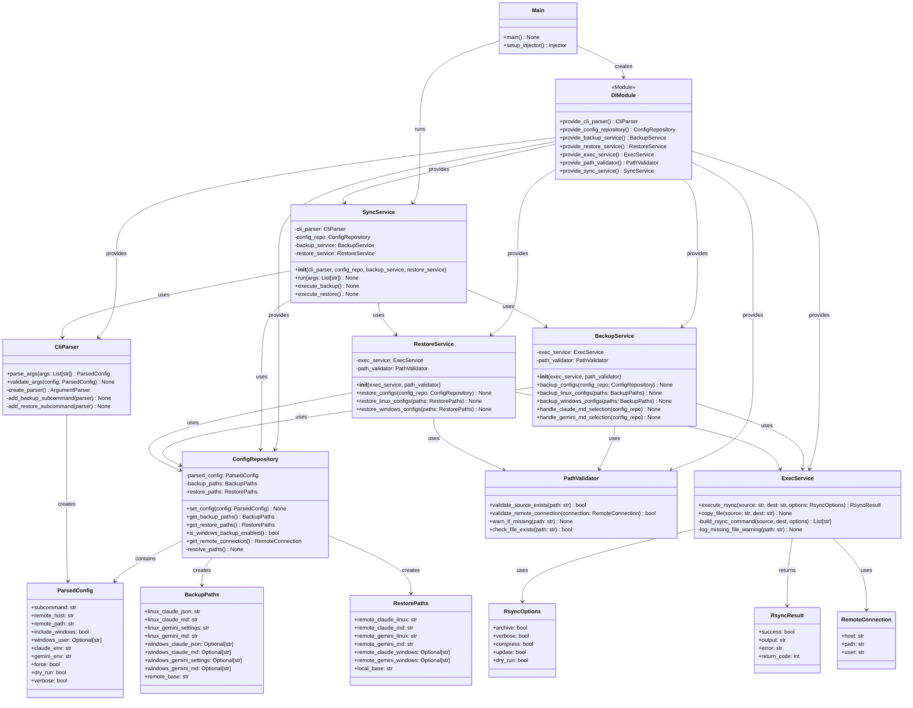

# AI Agent Config Sync Tool - Design Document (ARCHIVED)

**⚠️ NOTE: This design document represents an over-engineered approach that was ultimately replaced by a simple, working script (`sync-ai-config.py`). It is preserved here as a reference for what NOT to do - a demonstration of how complex architectures can be counterproductive when simple solutions work better.**

**The actual implementation**: A single 590-line Python script that accomplishes all the goals below without the complexity.

## Overview

The AI Agent Config Sync Tool is a CLI application that synchronizes Claude Code and Gemini CLI configurations between local environments (Linux/Windows) and a remote server. The tool provides backup and restore functionality with built-in file protection and validation.

## Requirements

### Functional Requirements

- **CLI-only Configuration**: All parameters provided via command-line arguments, no configuration files
- **Dual Environment Support**: Handle both Linux and Windows environments (Windows via `/mnt/c/` path)
- **File Protection**: Use rsync's `--update` flag by default to prevent overwriting newer files
- **Source Validation**: Check source file existence, warn and skip if missing
- **Environment Selection**: Allow selection of CLAUDE.md and GEMINI.md from specific environments
- **Cross-environment Copying**: Copy selected environment files to alternate environment during backup

### Non-Functional Requirements

- **Packaging**: Distribute as executable using PyInstaller
- **Error Handling**: Graceful handling of missing files and network issues
- **Transparency**: Verbose output options for operation visibility
- **Performance**: Efficient rsync-based file transfers

## CLI Interface Design

### Main Command Structure

```bash
sync-ai-config <subcommand> [options]
```

### Subcommands

#### Backup Command
Upload local configurations to remote server:

```bash
sync-ai-config backup --remote-host <user@host> --remote-path <path> [options]
```

**Required Arguments:**
- `--remote-host <user@host>` - Remote server connection (e.g., `user@server.example.com`)
- `--remote-path <path>` - Remote directory path (e.g., `~/sync-files/ai-agents-related/`)

**Optional Flags:**
- `--include-windows` - Also backup Windows configs from `/mnt/c/`
- `--windows-user <username>` - Windows username (required with `--include-windows`)
- `--claude-env <linux|windows>` - CLAUDE.md environment to use as primary (default: linux)
- `--gemini-env <linux|windows>` - GEMINI.md environment to use as primary (default: linux)
- `--force` - Disable rsync `--update` mode, overwrite newer remote files
- `--dry-run` - Show operations without executing
- `--verbose` - Show detailed rsync output

#### Restore Command
Download configurations from remote server:

```bash
sync-ai-config restore --remote-host <user@host> --remote-path <path> [options]
```

**Required Arguments:**
- `--remote-host <user@host>` - Remote server connection
- `--remote-path <path>` - Remote directory path

**Optional Flags:**
- `--include-windows` - Also restore Windows configs to `/mnt/c/`
- `--windows-user <username>` - Windows username (required with `--include-windows`)
- `--force` - Disable rsync `--update` mode, overwrite newer local files
- `--dry-run` - Show operations without executing
- `--verbose` - Show detailed rsync output

## Architecture Design

### Class Structure

The application follows a service-oriented architecture with dependency injection:



### Key Design Patterns

1. **Service Orchestration**: `SyncService` coordinates parsing, configuration, and operation execution
2. **Repository Pattern**: `ConfigRepository` maintains stateful configuration as single source of truth
3. **Dependency Injection**: Clean separation via `di_module.py`, no DI imports in business logic
4. **Strategy Pattern**: Separate `BackupService` and `RestoreService` for operation-specific logic

## File Handling Specification

### File Paths

#### Linux Environment
- Claude JSON: `~/.claude.json`
- Claude MD: `~/.claude/CLAUDE.md`
- Gemini Settings: `~/.gemini/settings.json`
- Gemini MD: `~/.gemini/GEMINI.md`

#### Windows Environment (via Linux)
- Claude JSON: `/mnt/c/Users/{username}/.claude.json`
- Claude MD: `/mnt/c/Users/{username}/.claude/CLAUDE.md`
- Gemini Settings: `/mnt/c/Users/{username}/.gemini/settings.json`
- Gemini MD: `/mnt/c/Users/{username}/.gemini/GEMINI.md`

#### Remote Server Naming Convention
- `.claude.linux.json` / `.claude.windows.json`
- `CLAUDE.md` (primary environment selection)
- `gemini.settings.linux.json` / `gemini.settings.windows.json`
- `GEMINI.md` (primary environment selection)

### Rsync Configuration

#### Default Protection Mode
```bash
rsync -avz --update <source> <destination>
```

#### Force Mode (with --force flag)
```bash
rsync -avz <source> <destination>
```

**Rsync Flags:**
- `-a`: Archive mode (recursive, preserve permissions, timestamps, etc.)
- `-v`: Verbose output (when `--verbose` specified)
- `-z`: Compress during transfer
- `--update`: Skip files newer at destination (default behavior)

### Environment Selection Logic

#### Backup Behavior
1. **CLAUDE.md/GEMINI.md Selection**: Use `--claude-env`/`--gemini-env` to choose source environment
2. **Cross-environment Copy**: Copy selected MD file to alternate environment before backup
3. **Primary Upload**: Upload selected MD file as `CLAUDE.md`/`GEMINI.md` on remote server

#### Restore Behavior
1. **Primary Download**: Download `CLAUDE.md`/`GEMINI.md` from remote server
2. **Environment Distribution**: Restore to both Linux and Windows (if `--include-windows` specified)

## Error Handling

### Source File Validation
```python
def validate_source_exists(self, path: str) -> bool:
    """Validates that a source file exists.

    If the file does not exist, a warning is logged.

    Args:
        path: The path to the file to validate.

    Returns:
        True if the file exists, False otherwise.
    """
    if not os.path.exists(path):
        logger.warning("Source file does not exist, skipping: %s", path)
        return False
    return True
```

### Error Scenarios
- **Missing Source Files**: Log warning, skip file, continue operation
- **Network Connectivity**: Fail with descriptive error message
- **Permission Issues**: Fail with permission error details
- **Invalid Arguments**: Fail fast with usage information

## Implementation Approach

### Development Phases

#### Class-by-Class Implementation with Lazy Data Models

**Phase 1: Core Infrastructure Classes**

1. **CliParser** + **ParsedConfig** data class
   - Implement command line argument parsing and validation
   - Create ParsedConfig data class for CLI argument container
   - Unit tests for argument validation and edge cases

2. **PathValidator** 
   - Implement file existence checks and validation utilities
   - Unit tests for path validation scenarios

3. **ExecService** + **RsyncOptions** + **RsyncResult** data classes
   - Implement system command execution (rsync, file operations)
   - Create RsyncOptions data class for configuration parameters
   - Create RsyncResult data class for execution results
   - Unit tests with mocked external dependencies

**Phase 2: Configuration Management**

4. **ConfigRepository** + **BackupPaths** + **RestorePaths** + **RemoteConnection** data classes
   - Implement stateful configuration management and path resolution
   - Create BackupPaths data class for backup file path management
   - Create RestorePaths data class for restore file path management
   - Create RemoteConnection data class for server connection info
   - Unit tests for configuration state management

**Phase 3: Business Logic Services**

5. **BackupService**
   - Implement backup operations, environment selection logic
   - Add cross-environment file copying functionality
   - Unit tests for backup workflows and error scenarios

6. **RestoreService**
   - Implement restore operations and file distribution logic
   - Unit tests for restore workflows and error scenarios

**Phase 4: Orchestration Classes**

7. **SyncService**
   - Implement main service coordinator and workflow orchestration
   - Integration tests for service interactions

8. **DIModule**
   - Implement dependency injection configuration and provider methods
   - Unit tests for dependency resolution

9. **Main**
   - Implement application entry point and injector setup
   - Integration tests for full application flow

**Phase 5: End-to-End Testing and Distribution**
- Comprehensive end-to-end testing with actual file operations
- Error case testing for all failure scenarios
- Configure PyInstaller for executable creation
- Test executable on target Linux environments
- Create deployment documentation

#### Implementation Benefits

This just-in-time approach provides:
- **Lazy Data Model Creation**: Data classes implemented only when needed by consuming classes
- **Test-Driven Development**: Unit tests implemented alongside each class
- **Clear Dependencies**: Each class builds on previously implemented components
- **Continuous Validation**: Working functionality verified at each step
- **Reduced Over-Engineering**: No unused data structures or premature abstractions

### Testing Strategy

- **Unit Tests**: Mock external dependencies, test business logic isolation
- **Integration Tests**: Test service interactions with real file system
- **End-to-end Tests**: Full CLI workflow tests with temporary directories
- **Error Case Testing**: Comprehensive error scenario coverage

### Logging Strategy

```python
import logging

logger = logging.getLogger(__name__)

# Usage examples:
logger.info("Starting backup operation with %s files", file_count)
logger.warning("Source file does not exist: %s", source_path)
logger.error("Failed to connect to remote server: %s", error_message)
```

## Deployment

### PyInstaller Configuration
- **Single Executable**: Bundle all dependencies into one file
- **Cross-platform**: Target Linux x64 systems
- **Dependency Management**: Include all required Python packages
- **Entry Point**: `sync-ai-config` command

### Distribution Requirements
- **Python 3.8+**: Minimum Python version requirement
- **rsync**: Must be available on target Linux systems
- **SSH Access**: Configured SSH key-based authentication to remote server

## Security Considerations

- **SSH Key Authentication**: No password handling in application
- **Path Validation**: Prevent path traversal attacks
- **File Permissions**: Preserve original file permissions during sync
- **Error Information**: Avoid exposing sensitive paths in error messages

## Future Enhancements

- **Configuration Profiles**: Save frequently used remote server configurations
- **Incremental Backup**: Track and sync only changed files
- **Encryption**: Optional file encryption during transfer
- **GUI Interface**: Desktop application wrapper for CLI tool
- **Cloud Storage**: Support for cloud storage backends (AWS S3, Google Drive)
